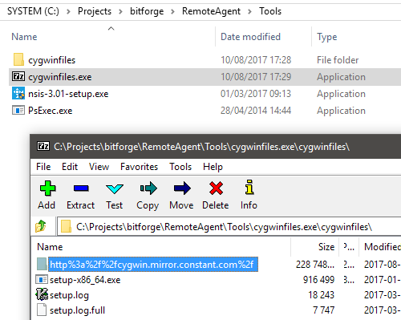
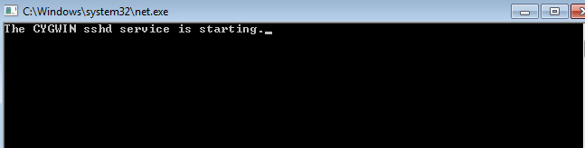

### Instalador de um ssh Windows standalone

O instalador do server do sincronismo de arquivos é apenas um executável com todas suas dependências embutidas, incluindo o Cygwin (e seus módulos necessários, rsync e openssh) e o NSIS, o gerador de instalador que será usado no server para gerar o instalador da versão client.

**ATENÇÃO: Para que a geração do instalador na máquina do desenvolvedor funcione corretamente será necessário o uso das ferramentas Psexec e o instalador do NSIS.**

ATENÇÃO: O arquivo **cygwinfiles.exe** necessário para a geração do instalador server é um SFX gerado pelo 7zip da pasta de download de uma instalação default do Cygwin camada de cygwinfiles mais os módulos rsync e openssh. Após a geração dessa pasta, no mesmo diretório deve ser copiado o executável de setup (setup-x86_64.exe). O servidor do cygwin usado para download não é relevante, mas é relevante que as dependências rsync e openssh estejam devidamente baixados.

A geração do instalador-server pode ser feita direto do projeto do Visual Studio localizado na pasta Install, RemoteAgentInstaller, RemoteAgentInstaller.sln. É nesta pasta que deve se encontrar o arquivo **cygwinfiles.exe**, necessário para a instalação do Cygwin na máquina servidora.

Ao executar o instalador server, existirão três módulos selecionados: Cygwin, Server e NSIS. Se o Cygwin já estiver instalado nesta máquina sua reinstalação será desnecessária. Se o NSIS já estiver instalado ou não for usado este modelo de instalador client para o rsync, não será necessário instalar. O Server é o conjunto de passos necessários para configurar ou reconfigurar o serviço server de ssh que irá receber as requisições de sincronismo de arquivos, além da montagem dos binários necessários para a construção do instalador cliente.

Ao clicar em instalar deixe o processo prosseguir. Serão instalados os módulos escolhidos automaticamente. Os arquivos do cygwin estão compactados em um SFX que será extraído e iniciada sua instalação. Os scripts do cygwin necessários, ssh-host-config e ssh-user-config, serão instalados em seguida.

Apenas a parte de instalação do NSIS está no manual, o usuário devendo seguir a instalação com seus valores default, exceto a última tela, onde ele poderá desclicar as opções de executar a ferramenta e abrir o README da instalação.

Após a conclusão do instalador, na pasta de instalação (c:\\remoteagent) existirão as pastas rsync, com as dependências do cygwin no cliente, home, com as chaves de criptografia do cliente, e uploads, para o teste de envio de arquivos no cliente.

Dentro da pasta-raiz há a batch GenerateRemoteAgentClientInstaller.bat que executa o NSIS gerando o instalador cliente baseado no projeto (na mesma pasta) RemoteAgentInstallerClient.nsi. O executável gerado pode ser usado para instalar a versão cliente nas máquinas onde se deseja fazer o teste de sincronismo.

As pastas geradas no client refletem as do server, com a rsync e home sendo réplicas. No entanto, uma batch dentro de rsync, ClientCloseKeys, é usada no instalador para configurar a segurança das chaves privadas, apenas possuíndo o usuário ssh_client permissão de abrir as chaves privadas.

ATENÇÃO: Será criado nas máquinas-cliente, se ainda não existir, um usuário de nome ssh_client. Essa é a conta que deverá ser usada no teste de sincronismo.

Com a instalação cliente concluída, rode um prompt de comando na conta do usuário ssh_client e execute a batch TestClient.bat dentro da pasta rsync.

Após a conclusão da execução, se estiver tudo correto, uma pasta com o nome da máquina-cliente terá sido criada no servidor dentro da pasta uploads, e dentro dela uma cópia do próprio script que foi executado.

